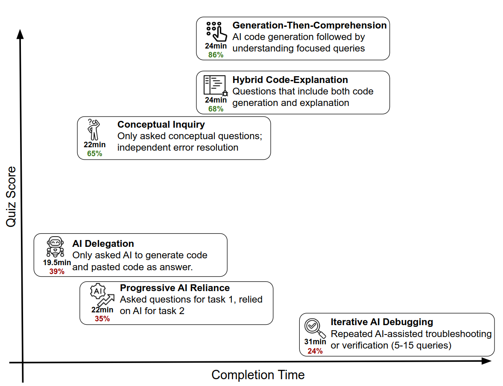
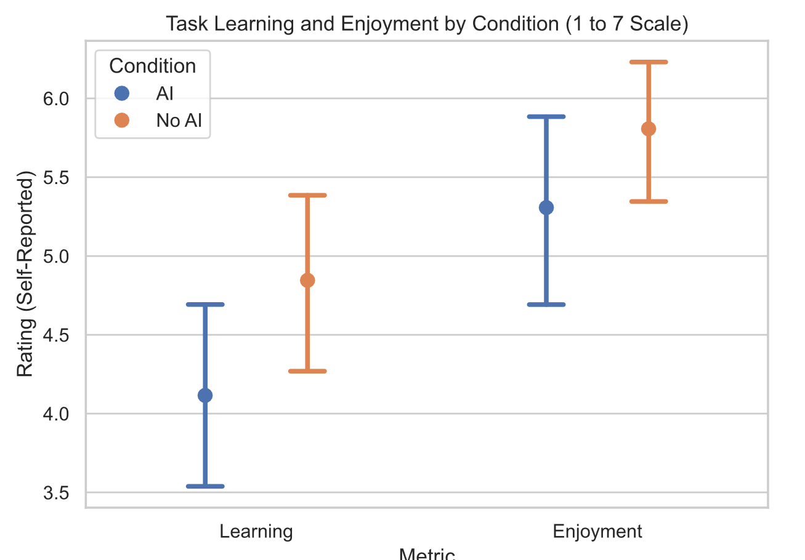
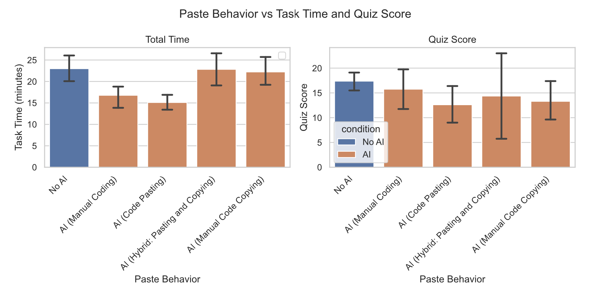

## Setup
This discussion took software engineering as its main subject, since it aligns with my profession.

## The spark

In my sceptical phase of the month, I had a thought about the excessive use of AI in coding, engineering and learning... and I questioned myself, does AI help us learn faster or am I delusional ? and does it hand us some false confidence along the way?

## studying a new python library
### Intro
There is a study made on two groups: one was permitted to use AI, the other was not. Both groups had to learn a new python library through a task, then complete a quiz at the end.
You can read it all [here](https://arxiv.org/abs/2601.20245).
Below is what I saw as the most important ideas:

### patterns 
The difference between high and low scoring patterns was the back and forth with AI to clarify and better understand the how and why before submitting. What separated them was not how many errors they hit, but who resolved them: working through your own errors drives the learning, while handing the debugging to the AI does not.

### Moral after the tasks
Feedback was collected after the quiz. The No-AI group remarked that they found the task fun and the journey delightful. In contrast, the AI group reported a feeling of laziness, gaps in their understanding, and wished they had paid more attention.

### Pasting vs Manual Code copying hhhh 
Although it might seem weird, some individuals believe that copying manually (typing the generated code into their codebase) is different from copy-pasting directly. In that study, participants who manually copied the AI-generated code were similar in pace to the No-AI group, yet got worse quiz scores.

## Maybe I can fly effect

This one was bothering me personally these days — the metacognition issue. Do I judge
myself incorrectly and take for granted things I have not really acquired ? AI gives you space to do
things and try what you have never seen, with confidence, but do you actually own
that, or did you just instantly understand the object, tool, or code slot in the current
project ? In later use, can you remember it for a different case, or will you have to re-learn it again ? AI gives so much information that you may process each piece only in the present moment of that conversation with AI, but there are no guarantees that you can actually use it
later on. You may even forget about it completely, depending on how much you processed afterward.
This rush of learning things will cause more harm than the steep curve of taking it slowly,
and that rush is the fuel of that self-fake-confidence.

The Dunning-Kruger effect (DKE) shows that highly skilled people underestimate their abilities or judge themselves close to correctly, while low-performing people tend to overestimate their skills. This [study](https://arxiv.org/abs/2409.16708) found that under AI use, that structure flattens: the link between your real skill and your self-assessment breaks, so self-judgment stops tracking how good you actually are. The risk is not that everyone rates themselves some fixed amount too high, it is that you can no longer place yourself at all, you can't tell how skilled you are or how much you really know. That lack of metacognition, the "you do not know that you do not know", is more dangerous than a simple lack of information. Now you can no longer detect those gaps in your profile, which can possibly lead to deskilling yourself over time.

## I'm fast
Bill Gates: measuring programming progress by lines of code is "like measuring aircraft building progress by weight".                                        
"I'm fast", maybe you just can't tell whether you are really as fast as you think. Or maybe you are measuring speed on well-scoped, greenfield, boilerplate tasks, or the first use of a new library or tool, none of which are reliable metrics. In the [METR 2025 RCT](https://arxiv.org/abs/2507.09089), developers believed they were 20% faster but were actually 19% slower, and that study was run on highly skilled developers who knew the codebase well and had maintained it for years. So the "knowing what to do" part
was the easiest part for them, because they were already familiar with those projects. AI wrote code that they still had to re-read and confirm before shipping, even though their 
prompts gave precise instructions. Prompting, waiting, and reviewing was slowing them down a bit, and that revives the risk of skill diminishing, since companies
are increasingly shipping AI-written code under human supervision. Humans can lose their ability to debug and supervise AI, going from copiloting to 
autopilot.
AI is excellent at scaffolding new projects, but you can't count on it once the codebase is already large.  

## fear of deskilling
I was building a project recently where the stack was very familiar. I guided Claude Code to implement my instructions precisely, and it
succeeded, of course, but the thing is: I felt like I was deskilling myself in my own thing, specifically in typing code.
But that thought got crossed by another one: Typing code isn't necessary anymore ?? We see this a lot lately. I genuinely do not know if that's 
a good idea or not. If you do not code, that gives you space to see more design and architecture, to think more about your choices, business
logic, and improvements. You just decide on Claude's behalf and let him do the repetitive work, but after a high frequency of these events, 
you may not even think anymore, and you may give up control to the LLM and just review code without any critical thinking. Claude's code
is always clean (if you have even a minimal skill level). It was trained on the best code blocks written in decades, we may not be able 
to write better than him, so it always sounds clever, even if that code doesn't serve the task at hand. If you can't see behind it, you 
will eventually have big chunks of code that compile but give no added value; and to have that superpower to see gaps in it (compared to the actual logic — again, the code
itself is not wrong), you hit an infinite loop: if you should review the code, you should have written code before, but if that "before" phase was also using AI, then
how would you assist AI now ?

## Should we adapt
So in my case, I thought about getting the best of both sides, coding with AI and without it. I do not feel comfortable about losing
my ability to write, and I do not want to get left behind in the current state of software engineering. I should be able to use AI-assisted coding
to get things done and "to adapt", while preserving my thing.

AI gives you wings, be careful not to hit the roof.

This writing does not state or confirm anything; it is a self-discussion and can be 1% or 100% wrong.
The studies mentioned above have many limitations, check them for more details, but at least they give a starting point for reflection.

You are welcome to strike anything said here and express your idea.